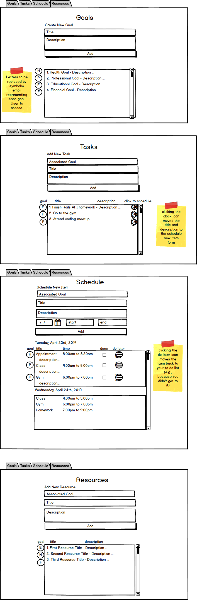

# Welcome to locus!

## Overview

Locus is a goal-oriented personal productivity tool. It's designed to provide users with a simple, flexible, and efficient tool for managing personal productivity. With locus, users have the ability to set and manage personal goals.

Users can create a new goal with a title and description, retreive a list of all goals they've created, retreive a single goal by ID, update a single goal by ID, and delete a single goal by ID.

## Development Process
1.  Understand minimum requirements
2.  Write user stories
3.  Sketch out wireframes
4.  Create new API using Ruby on Rails framework
5.  Generate scaffolds for resources
6.  Run database migrations
7.  Update resource controllers
8.  Update resource models
9.  Update routes
10. Write and test curl scripts
11. Set up basic layout of front end with HTML
12. Create forms and functions to test CRUD actions
13. Add style and state management features
14. Deploy

## Technologies Used
Front End: HTML, CSS, JavaScript, jQuery, Ajax, and Handlebars
Back End: Ruby on Rails, PostgreSQL

# Unsolved Problems

Project was down-scoped due to time constraints. In future iterations:

-add the ability to create tasks and connect tasks to Goals
-add the ability to add schedule
-add the ability to store resources

# Link to API Repo
https://github.com/shaider0/locus_API

# Link to Deployed Sites
CLIENT: https://shaider0.github.io/locusclient/
API: https://locusproductivity.herokuapp.com/

# User Stories
As a user, I want to keep track of goals that I've set for myself so that I can
work towards achieving them. I want to be able to write the goals down,
update them, find a single goal, delete a goal, and show all the goals I've
set for myself.

# Wireframes

